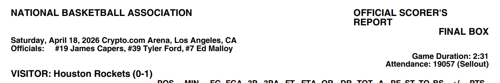

From Braxtyn 
>I want you to look into also integrating the table either into the rest of the text and/or giving the model more context on what the table is about. 
>For example some tables have headers that really do not give any indication of what data is there. The paragraph before does and without that the data in the table will never be found using semantic search. You either have to convert the table to natural language or convert what is embedded to natural language if that makes sense.


### Using an LLM to convert the table to natural language
First i used a package to quickly parse out a table
```python
from markdown_to_data import Markdown

md = Markdown(multiple_tables_markdown)
tables = [block['table'] for block in md.md_list if 'table' in block]
len(tables)
```
Converts this table 
```
### SCORE BY PERIOD
| PERIOD | 1 | 2 | 3 | 4 | FINAL |
|---:|---:|---:|---:|---:|---:|
| Pistons | 26 | 28 | 25 | 26 | 105 |
| MAGIC | 26 | 35 | 26 | 26 | 113 |
```
To: 

{'PERIOD': ['Pistons', 'MAGIC'],
 1: [26, 26],
 2: [28, 35],
 3: [25, 26],
 4: [26, 26],
 'FINAL': [105, 113]}

prompt = f"Convert this table row to a single natural language sentence:\n{row_str}"
Not consistent, LLM was able to pick up the PISTONS was scoring points, and Magic just refers to 'values'

>The Pistons tallied 26 points in the first period, 28 in the second, 25 in the third, and 26 in the fourth, finishing with a total of 105 points.

>During the MAGIC period, the values were 26 for 1, 35 for 2, 26 for 3, and 26 for 4, giving a final total of 113.

Additionally the table not being in consistent format made something wacky. For the box scores table, the final row is aggregateof everything
```
| POS | PLAYER | MIN | FG | FGA | 3P | 3PA | FT | FTA | OR | DR | TOT | A | PF | ST | TO | BS | +/- | PTS |
| :--- | :--- | :--- | :--- | :--- | :--- | :--- | :--- | :--- | :--- | :--- | :--- | :--- | :--- | :--- | :--- | :--- | :--- | :--- |
| **TOTAL** | | **240:00** | **36** | **89** | **15** | **33** | **26** | **33** | **14** | **34** | **48** | **22** | **24** | **8** | **14** | **8** | **8** | **113** |
| **PCT** | | | **40.4%** | | **45.5%** | | **78.8%** | | | | | | | | | | | |

```
This tripped up the llm a litle
> The player, listed at the position “PCT,” shot 43.5 % on field goals, 34.4 % from three‑point range, and 83.3 % on free throws.
> The player’s stats show a field‑goal percentage of 40.4 %, a three‑point percentage of 45.5 %, and a free‑throw percentage of 78.8 %.

#### Adding additional context
Extracting sections alongside the table added additional context had 
```python
def extract_sections(md_text: str) -> list[dict]:
    md = Markdown(md_text)
    sections = []
    
    def walk(d: dict, parent_label: str = ""):
        for key, val in d.items():
            if isinstance(val, dict):
                tables = {k: v for k, v in val.items() if isinstance(v, dict) and _is_table(v)}
                if tables:
                    for table_key, table in tables.items():
                        sections.append({"label": key or parent_label, "table": table})
                walk(val, parent_label=key)
    
    def _is_table(d: dict) -> bool:
        return d and all(isinstance(v, list) for v in d.values())
    
    walk(md.md_dict)
    return sections
```

```python
async def section_to_nl(section: dict, doc_context: str, model: str) -> list[str]:
    label = section["label"]
    table = section["table"]
    context = f"{doc_context}\nSection: {label}"
    return await table_to_nl(table, context=context, model=model)


async def row_to_nl(row: dict, context: str = "", model: str = "your-model") -> str:
    row_str = ", ".join(f"{k}: {v}" for k, v in row.items() if v is not None)
    prompt = f"{context}\nConvert this table row to a single natural language sentence:\n{row_str}"
    
    response = await client.chat.completions.create(
        model=model,
        max_tokens=2048,
        messages=[{"role": "user", "content": prompt}]
    )
    return response.choices[0].message.content


async def table_to_nl(table: dict, context: str = "", model: str = "your-model") -> list[str]:
    headers = list(table.keys())
    n = len(table[headers[0]])
    rows = [
        {k: table[k][i] for k in headers if table[k][i] is not None}
        for i in range(n)
    ]
    tasks = [row_to_nl(row, context, model) for row in rows]
    return await asyncio.gather(*tasks)
```
This made the llm natural language better, even when passing no additional doc level context

> The Detroit Pistons shot 43.5% from the field, 34.4% from three-point range, and 83.3% from the free‑throw line.
> The Orlando Magic shot 40.4 % overall, 45.5 % from three‑point range, and 78.8 % from the free‑throw line.

> The Pistons scored 26 points in the first period, 28 in the second, 25 in the third, and 26 in the fourth, finishing with a total of 105 points.
>The Magic scored 26 points in the first quarter, 35 in the second, 26 in the third, and 26 in the fourth, finishing with a total of 113 points.


Maybe we could add doc level context, like for instance the top of the pdf tells what day it is... 



