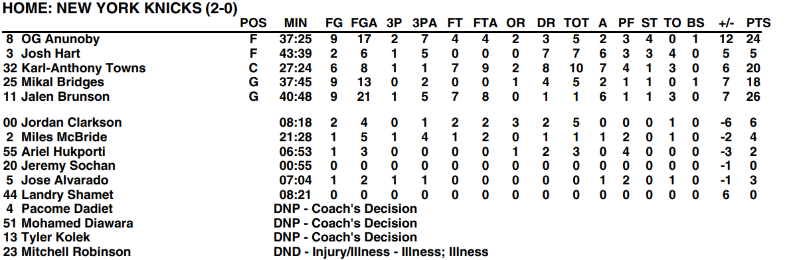

### Upgrading the vlm
Interestingly, changing the vlm to the new gemma-4-31B-it model made some good ground
I tested with a box score table for an NBA game.

The specific table didn't list what the leftmost column was. It was a column of player name and number.

In the pdf, there are no headers for playerName/number. so the header of the table was misalligned. The first column was split into 2 items
| POS | MIN | FG | FGA | 3P | 3PA | FT | FTA | OR | DR | TOT | A | PF | ST | TO | BS | +/- | PTS |
|---:|:---:|:--:|:--:|:--:|:---:|:--:|:---:|:--:|:--:|:--:|:--:|:--:|:--:|:--:|:--:|:--:|:--:|
| 9 | Ausar Thompson | F | 37:15 | 7 | 10 | 0 | 1 | 3 | 5 | 4 | 4 | 8 | 3 | 3 | 2 | 1 | -10 | 17 |

With upgrading the vlm, it ADDED the additonal context, changed the format,  and added to the column headers
| POS | PLAYER | MIN | FG | FGA | 3P | 3PA | FT | FTA | OR | DR | TOT | A | PF | ST | TO | BS | +/- | PTS |
| :--- | :--- | :--- | :--- | :--- | :--- | :--- | :--- | :--- | :--- | :--- | :--- | :--- | :--- | :--- | :--- | :--- | :--- | :--- |
| F | 9 Ausar Thompson | 37:15 | 7 | 10 | 0 | 1 | 3 | 5 | 4 | 4 | 8 | 3 | 3 | 2 | 1 | 5 | -10 | 17 |